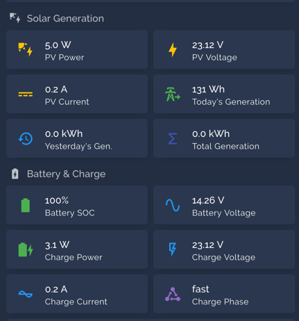

# noi-solar-controller-client

A python client for the **Noi/Limu LTM** solar charge controller over Bluetooth.

Features:
- Bluetooth auto discovery
- Publishes to an MQTT server
- Home Assistant MQTT auto discovery

*Depiction of the controller.*

*Telemetry in Home Assistant.*

## Interfaces

The controller has multiple interfaces:

**RS485**

Simple Modbus over RS485, though the RJ45 port. The modbus spec sheet is in the ``rs485`` folder.

**Bluetooth LE**

Basically a Bluetooth wrapper for the modbus interface. Modbus specs are the same.

The default client is the [Noi Solar](https://play.google.com/store/apps/details?id=com.wyadmin.solar.app&hl=en) app.

**Wifi**

Once connected to wifi, the controller connects to a private HTTP & MQTT server: https://lmsolar.wyadmin.com.

The HTTP API handles account management (user creation, pairing, ...).

The MQTT server handles telemetry. The telemetry is then consumed by the Noi Solar app.

I managed to reverse engineer parts of the API, but I failed to connect to the MQTT server.

## Quick start

Head over to [bluetooth/README.md](./bluetooth/README.md)

## Keywords

- Limu Solar: Device manufacturer
- Wyadmin / NOI Technologies: Telemetry system / app editor
- NOI Solar: iOS/Android client