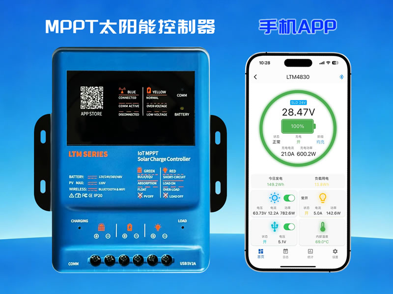
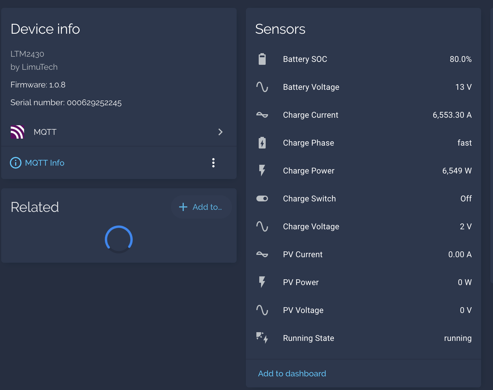

# noi-solar-controller-client



*Depiction of the controller.*



*Telemetry showing in Home Assistant.*

Reverse-engineered client for the **Noi/Limu LTM** solar charge controller (MPPT 24 V, BLE + Wi-Fi + Modbus).

Talks to the controller over **Bluetooth (BLE)**, the vendor **REST API**, and **MQTT**, giving you local telemetry without the official app — with Home Assistant auto-discovery.

```
LTM-252245 (BLE GATT FFF1)  ──Modbus RTU──▶  bridge  ──MQTT──▶  Home Assistant
```

## Quick start (BLE bridge)

```bash
cd bluetooth
python3 -m venv .venv && .venv/bin/pip install -r requirements.txt

# no hardware — fake telemetry through the MQTT path:
SIMULATE=1 MQTT_HOST=192.168.1.10 .venv/bin/python -m app

# with your controller:
MQTT_HOST=192.168.1.10 .venv/bin/python -m app
```

Or run in Docker (needs a Linux host with Bluetooth):

```bash
cd bluetooth && docker compose up -d --build
```

Environment: `MQTT_HOST`, `CONTROLLER_ADDRESS` (skip scan), `BLE_PIN` (unlock PIN, default `000000`), `POLL_INTERVAL`, `SIMULATE`. Full table in `bluetooth/README.md`.

## What works

- **BLE**: full local telemetry (PV/battery/charge) — auth-gated config area unlock solved (`BLE_PIN`).
- **MQTT → HA**: 18 entities, auto-discovery, retained state + LWT.
- Dump registers from the CLI: `python bluetooth/ble_modbus.py read 0x00A0 1`.

## Layout

| Path | What's in it |
|------|--------------|
| `bluetooth/` | BLE bridge (bleak → Modbus RTU → MQTT + HA), `ble_modbus.py` CLI, `BLE.md`, Docker |
| `api/` | Vendor REST API (`HTTP-API.md`) and MQTT broker (`MQTT.md`) references |
| `rs485/` | Modbus register map + framing (`PROTOCOL.md`), vendor protocol PDF |
| `ARCHITECTURE.md` / `TODO.md` | Big picture and open questions |

The controller speaks the same Modbus RTU on **every** channel (BLE GATT, RS485, cloud MQTT relay) — protocol details verified live on device live in `rs485/PROTOCOL.md`.

## Status

Reverse-engineering complete enough for local monitoring. Charge-parameter registers (config area `0x0400+`) are now unlocked but not yet fully mapped; writes (RTC, load/USB switch, charge params) are not implemented. See `TODO.md`.

## Security

Reverse-engineering notes, not an exploit. No vendor credentials are stored in this repo.